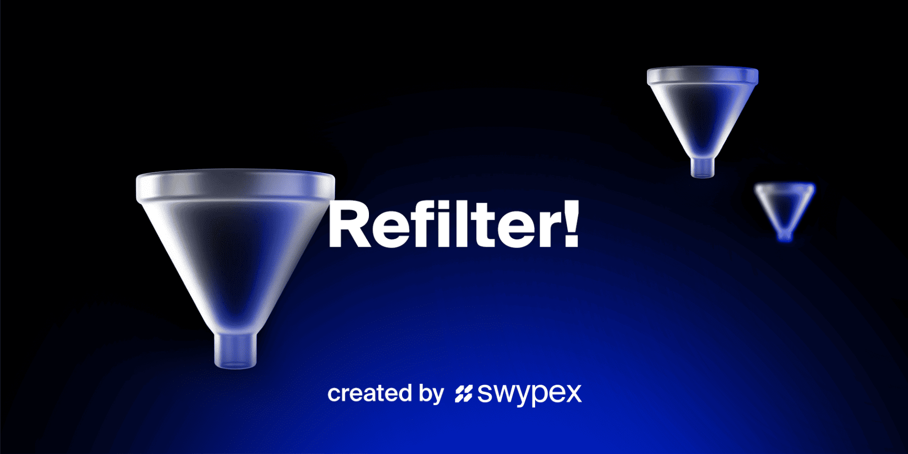

 
<p align="center">
  <a href="https://www.npmjs.com/package/@swypex/refilter" rel="noopener">
 </a>
</p>

<h1 align="center">@swypex/refilter</h1>

<div align="center">

[]()
[]()
[]()
[](/LICENSE)

</div>

---

<p align="center">
A powerful and flexible React library to effortlessly add robust filtering capabilities to your applications, simplifies creating dynamic and interactive user interfaces, allowing users to filter through large datasets easily
    <br> 
</p>

## 📝 Table of Contents

- [About](#-about)
- <a href="#getting_started">Getting Started</a>
- <a href="#deployment">Deployment</a>
- <a href="#usage">Usage</a>
- <a href="#built_using">Built Using</a>
- [Contributing](https://github.com/useswype/refilter/graphs/contributors)
- <a href="#authors">Authors</a>


## 🧐 About

This project aims to enhance the filtering capabilities of tables and lists within various applications. This project aims to streamline data analysis and information retrieval processes by providing a comprehensive filtering tool package. The package offers a range of filtering options, including text search, numerical range selection, and custom filtering criteria. With its user-friendly interface and efficient algorithms, this project empowers users to quickly and accurately filter large datasets, saving time and effort.

## <span id="getting_started">🏁 Getting Started</span>


### Installing
make sure you have node version >= 16 and react 

```
npm i @swypex/refilter
``` 

add this on global css 

```
@import '~@swypex/refilter/output/main.css';
```

## 🎈 Usage <a id="usage"></a>


End with an example of getting some data out of the system or using it for a little demo.
## - If you need to add custom style for the filter 
```
import { createStyledGenericFilter } from '@swypex/refilter';

export const StyledGenericFilter = createStyledGenericFilter({
  closeButton: 'bg-red-100',
});


import { StyledGenericFilter as GenericFilter } from '@/components/GenericFilterWrapper';

<GenericFilter />
```
## - If you need to add specific style for the filter 
```
import { GenericFilter } from '@swypex/refilter';

<GenericFilter
  classname={{
    closeButton: 'bg-red-100',
  }}
/>
```
## - If you need to use the default swypex design system  
```
import { GenericFilter } from '@swypex/refilter';

<GenericFilter />
```
## - How to create your filter component
### the filter component has the constant boilerplate code you need to follow 

```
import {
  type ShortcutComponentProps,
  type FilterComponentProps,
} from '@swypex/refilter';

export interface FilterComponentProps {
  status: Nullable<boolean>;
}

export function FilterComponent(props: FilterComponentProps<FilterComponentProps>) {
  const { onChange, value } = props;
  retrun (
    <div></div>
  )
}


function FilterComponentFilterShortcut(props: ShortcutComponentProps<FilterComponentProps>) {
  const { value, onChange } = props;
    retrun (
    <div></div>
  )
}

FilterComponent.Shortcut = FilterComponentFilterShortcut;

FilterComponent.comparator = (a: FilterComponentProps, b: FilterComponentProps) => {
  return a?.status === b?.status;
};

FilterComponent.getBadgeCount = (value: FilterComponentProps) => {
  return value.status !== null ? 1 : 0;
};

```

## 🚀 Deployment <a id="deployment"></a>

Add additional notes about how to deploy this on a live system.

## ⛏️ Built Using <a id="built_using"></a>

- [Rollup](https://rollupjs.org/)

```
npm run bundle
```


## ✍️ Authors <a id="authors"></a>

See also the list of [contributors](https://github.com/useswype/refilter/graphs/contributors) who participated in this project.
